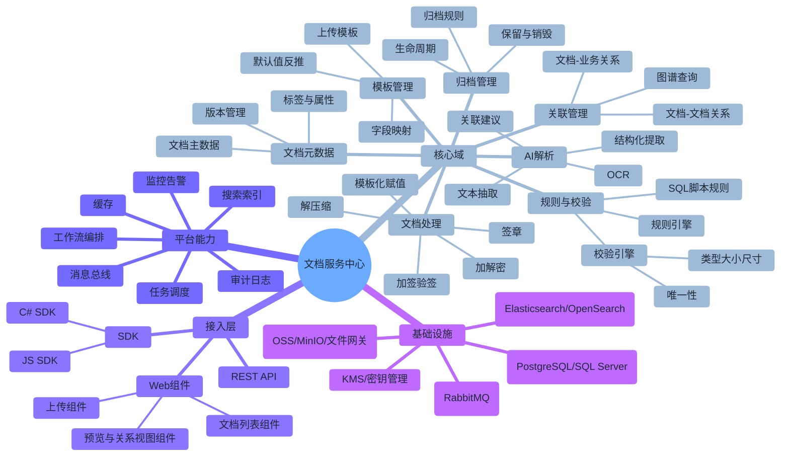
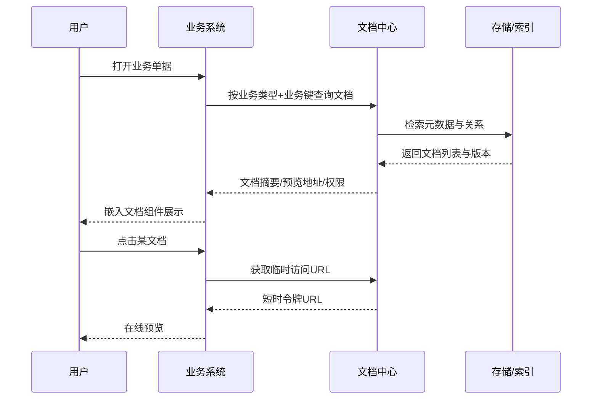
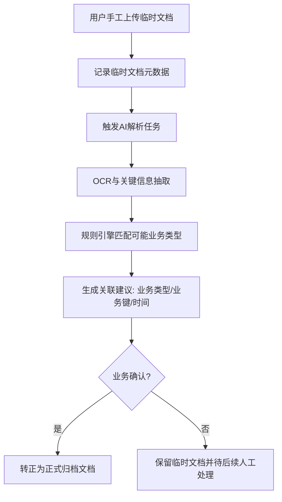

# 医疗平台文档服务中心微服务技术设计与实施计划

## 0. 背景与设计目标

### 0.1 业务背景
当前医院平台中的成本、费控、财务、流程、药品、病历、影像等系统均为独立部署，附件文档分散在不同 Windows 服务器磁盘，存在以下问题：

- 文档标准不统一，跨系统检索与关联困难
- 存储与安全策略分散，审计与合规成本高
- 业务系统重复建设上传、校验、归档与预览能力
- 难以支持文档级高级能力（签章、加解密、模板化解析、AI抽取）

### 0.2 总体目标
建设独立的文档服务中心，作为公共微服务/组件，为所有业务系统提供：

- C# SDK + JS SDK + Web 组件 + REST API 四种接入形态
- 统一归档与检索能力（日期 + 业务类型 + 业务键）
- 文档与业务数据、文档与文档的双向关联
- 完整文档处理链路（加签/验签/签章/加解密/解压缩/模板赋值）
- 支持临时上传并基于文档内容自动解析关联（含 AI）
- 模板引擎 + 规则引擎 + 校验引擎

### 0.3 建议架构原则

- 领域解耦：元数据、文件对象、处理任务、关系图谱分层
- 异步优先：重处理链路采用事件驱动，避免阻塞业务请求
- 安全合规：传输、存储、访问、操作全链路可审计
- 可扩展：规则、解析器、处理器、存储后端均插件化

---

## 1. 系统总体设计（思维导图）



### 1.1 逻辑分层

- API Gateway 层：统一认证、鉴权、限流、路由
- Document Center 服务层：接入编排、模板与规则执行、文档任务编排
- Processing Worker 层：异步处理（压缩、加密、签章、AI解析）
- Data 层：元数据库 + 对象存储 + 搜索索引 + 审计仓

### 1.2 部署建议

- 最小可行：2 套实例（主服务 + Worker）
- 推荐生产：
  - 文档中心服务 3 副本
  - 处理 Worker 3-6 副本（按任务量弹性）
  - 对象存储主从或集群
  - 数据库主备 + 只读副本

---

## 2. 流程设计（图表 + 场景说明）

### 2.1 通用模板化上传与归档流程


### 2.2 业务系统嵌入查看流程（文档与业务关联）



### 2.3 临时上传 + AI 解析 + 关联反推流程



### 2.4 场景举例说明

1. 财务系统年度/月度报告存档
- 通过财务报告模板上传 PDF/Excel，自动校验月份唯一性
- 执行签章与加密后归档，形成年度目录树

2. 影像系统关联电子病历
- 影像附件按患者ID+就诊号关联电子病历
- 文档与文档建立关系（影像报告 -> 原始影像）

3. 费控系统季度报告
- 报告提交后触发模板赋值与签章
- 归档后向管理驾驶舱推送索引信息

4. 流程系统审批归档
- 流程结束自动打包审批记录与附件
- 生成统一档案包并加密存储

5. 药品系统库存月报
- 月度任务自动生成报表并上传
- 按药品分类和月份建立索引

---

## 3. 功能清单（表格）

| 功能域 | 子功能 | 说明 | 优先级 | 阶段 |
|---|---|---|---|---|
| 接入能力 | REST API | 标准上传、查询、下载、关系管理接口 | P0 | M1 |
| 接入能力 | SDK（C#/JS） | 提供统一调用封装、鉴权、重试、幂等 | P0 | M1 |
| 接入能力 | Web组件 | 上传器、文档列表、预览器、关系图组件 | P1 | M2 |
| 模板中心 | 模板定义 | 字段、必填、默认值、映射规则 | P0 | M1 |
| 模板中心 | 默认值反推 | 临时上传时按规则反推模板与字段 | P1 | M2 |
| 校验中心 | 基础校验 | 类型、大小、尺寸、病毒扫描、唯一性 | P0 | M1 |
| 规则中心 | SQL规则 | 支持业务关联校验/反查规则 | P1 | M2 |
| 文档处理 | 解压缩 | zip/rar/7z 解压与内容登记 | P1 | M2 |
| 文档处理 | 加解密 | 按模板策略进行加解密与密钥轮换 | P0 | M1 |
| 文档处理 | 签章链路 | 加签、验签、电子签章、时间戳 | P0 | M2 |
| 关联管理 | 文档-业务关联 | 支持一对多、多对多关系维护 | P0 | M1 |
| 关联管理 | 文档-文档关联 | 引用、来源、派生关系追踪 | P1 | M2 |
| AI能力 | 文档解析 | OCR、实体抽取、分类预测、关联建议 | P2 | M3 |
| 检索能力 | 结构化检索 | 日期+业务类型+业务键检索 | P0 | M1 |
| 检索能力 | 全文检索 | 文档内容全文索引与高亮 | P1 | M2 |
| 归档管理 | 生命周期 | 归档、封存、解封、销毁策略 | P1 | M2 |
| 安全合规 | 审计日志 | 操作日志、下载日志、签章日志 | P0 | M1 |
| 安全合规 | 权限控制 | 租户/系统/角色/文档粒度授权 | P0 | M1 |
| 运维治理 | 监控告警 | 任务积压、失败率、存储阈值告警 | P0 | M1 |
| 运维治理 | 配置中心 | 模板、规则、处理策略动态配置 | P1 | M2 |

---

## 4. 模型设计（数据库实体表格）

> 说明：以下为建议逻辑模型，建议优先落 SQL Server 或 PostgreSQL。对象内容本体存储在对象存储中，数据库保存元数据和关系。

| 实体表 | 核心字段 | 说明 | 关键索引/约束 |
|---|---|---|---|
| dc_document | id, doc_no, title, biz_type, biz_key, tenant_id, status, content_hash, storage_uri, created_at | 文档主表 | unique(tenant_id, doc_no), idx(biz_type, biz_key, created_at), idx(content_hash) |
| dc_document_version | id, document_id, version_no, storage_uri, size_bytes, mime_type, created_by, created_at | 文档版本 | unique(document_id, version_no) |
| dc_document_property | id, document_id, prop_key, prop_value, source | 文档动态属性 | idx(document_id), idx(prop_key, prop_value) |
| dc_archive_record | id, document_id, archive_date, archive_batch_no, retention_policy_id, archive_status | 归档记录 | idx(archive_date), idx(archive_batch_no) |
| dc_biz_relation | id, document_id, biz_system, biz_type, biz_key, relation_type | 文档与业务关系 | idx(biz_system, biz_type, biz_key), idx(document_id) |
| dc_doc_relation | id, from_document_id, to_document_id, relation_type, direction | 文档间关系 | idx(from_document_id), idx(to_document_id) |
| dc_template | id, template_code, template_name, biz_type, is_active, version, created_at | 上传模板定义 | unique(template_code, version), idx(biz_type) |
| dc_template_field | id, template_id, field_code, field_name, data_type, required, default_expr, validate_expr | 模板字段 | unique(template_id, field_code) |
| dc_rule | id, rule_code, rule_type, script_type, script_content, priority, is_active | 规则定义 | unique(rule_code), idx(rule_type, is_active) |
| dc_rule_binding | id, rule_id, template_id, biz_type, trigger_stage | 规则绑定 | idx(rule_id), idx(template_id, trigger_stage) |
| dc_validation_policy | id, policy_code, file_types, max_size_mb, max_width, max_height, unique_scope | 校验策略 | unique(policy_code) |
| dc_upload_session | id, upload_no, tenant_id, source_system, source_user, template_id, status, created_at | 上传会话 | unique(upload_no), idx(source_system, created_at) |
| dc_processing_job | id, job_no, document_id, job_type, job_status, retry_count, payload_json, started_at, finished_at | 异步处理任务 | unique(job_no), idx(job_status, job_type), idx(document_id) |
| dc_processing_job_log | id, job_id, step_name, step_status, message, occurred_at | 任务日志 | idx(job_id, occurred_at) |
| dc_signature_record | id, document_id, sign_type, cert_sn, signer, signed_at, verify_status | 签章/签名记录 | idx(document_id), idx(cert_sn) |
| dc_encryption_record | id, document_id, algorithm, key_id, encrypted_at, decrypt_audit_flag | 加解密记录 | idx(document_id), idx(key_id) |
| dc_ai_parse_result | id, document_id, model_name, extracted_json, confidence, suggested_biz_type, suggested_biz_key, parsed_at | AI解析结果 | idx(document_id), idx(suggested_biz_type, suggested_biz_key) |
| dc_audit_log | id, tenant_id, operator_id, action, object_type, object_id, ip, user_agent, created_at | 审计日志 | idx(tenant_id, created_at), idx(object_type, object_id) |
| dc_permission_grant | id, subject_type, subject_id, object_type, object_id, permission, expires_at | 细粒度权限 | idx(subject_type, subject_id), idx(object_type, object_id) |
| dc_retention_policy | id, policy_code, policy_name, retain_years, destroy_mode, approval_required | 保留策略 | unique(policy_code) |

### 4.1 关键关系

- dc_document 1:N dc_document_version
- dc_document 1:N dc_document_property
- dc_document 1:N dc_archive_record
- dc_document 1:N dc_biz_relation
- dc_document N:M dc_document（通过 dc_doc_relation）
- dc_template 1:N dc_template_field
- dc_rule N:M dc_template（通过 dc_rule_binding）
- dc_document 1:N dc_processing_job

---

## 5. API 设计（HTTP RESTful）

### 5.1 接口规范约定

- 鉴权：Bearer JWT + 系统级 API Key（可选）
- 幂等：上传与处理触发接口支持 Idempotency-Key
- 返回体：统一 envelope
  - code: 业务码
  - message: 描述
  - data: 业务数据
  - traceId: 链路追踪号

### 5.2 API 清单

| 分类 | 方法 | 路径 | 说明 | 关键请求参数 | 响应摘要 |
|---|---|---|---|---|---|
| 上传 | POST | /api/v1/uploads/init | 初始化上传会话 | sourceSystem, templateCode, bizType, bizKey | uploadNo, uploadUrl |
| 上传 | PUT | /api/v1/uploads/{uploadNo}/content | 上传文件内容（直传或中转） | file, checksum, contentType | documentId, versionNo |
| 上传 | POST | /api/v1/uploads/{uploadNo}/commit | 提交上传并触发校验/处理 | metadata, idempotencyKey | jobNo, status |
| 文档 | GET | /api/v1/documents/{documentId} | 获取文档详情 | path: documentId | 文档主数据+属性 |
| 文档 | GET | /api/v1/documents | 按条件检索文档 | bizType, bizKey, fromDate, toDate, tags | 列表+分页 |
| 文档 | GET | /api/v1/documents/{documentId}/preview-url | 获取预览临时URL | expireSeconds | previewUrl |
| 文档 | GET | /api/v1/documents/{documentId}/download-url | 获取下载临时URL | expireSeconds | downloadUrl |
| 文档 | POST | /api/v1/documents/{documentId}/versions | 新增文档版本 | file, changeRemark | versionNo |
| 归档 | POST | /api/v1/archives | 创建归档记录 | documentId, archiveDate, policyCode | archiveRecordId |
| 归档 | GET | /api/v1/archives | 查询归档记录 | bizType, bizKey, archiveDate | 归档列表 |
| 关系 | POST | /api/v1/relations/biz | 新增文档-业务关联 | documentId, bizSystem, bizType, bizKey | relationId |
| 关系 | POST | /api/v1/relations/doc | 新增文档-文档关联 | fromDocumentId, toDocumentId, relationType | relationId |
| 关系 | GET | /api/v1/relations/graph/{documentId} | 获取关联图谱 | depth, relationTypes | 节点和边 |
| 模板 | POST | /api/v1/templates | 创建模板 | templateCode, fields | templateId |
| 模板 | PUT | /api/v1/templates/{templateId} | 更新模板 | fields, status | success |
| 模板 | POST | /api/v1/templates/infer | 临时上传模板反推 | documentId, hints | templateSuggestion |
| 规则 | POST | /api/v1/rules | 创建规则 | ruleType, scriptType, scriptContent | ruleId |
| 规则 | POST | /api/v1/rules/{ruleId}/bind | 规则绑定模板/业务 | templateId, triggerStage | success |
| 处理 | POST | /api/v1/process/jobs | 手工触发处理任务 | documentId, jobType, options | jobNo |
| 处理 | GET | /api/v1/process/jobs/{jobNo} | 查询任务状态 | path: jobNo | status, steps |
| AI | POST | /api/v1/ai/parse | 触发文档解析 | documentId, parseMode | parseJobNo |
| AI | GET | /api/v1/ai/parse/{documentId}/result | 获取解析结果 | path: documentId | extractedData, suggestions |
| 审计 | GET | /api/v1/audits | 查询操作日志 | operatorId, action, objectType, fromDate, toDate | 审计列表 |
| 权限 | POST | /api/v1/permissions/grants | 授权 | subject, object, permission | grantId |
| 权限 | DELETE | /api/v1/permissions/grants/{grantId} | 撤销授权 | path: grantId | success |

### 5.3 典型请求示例（上传提交）

```http
POST /api/v1/uploads/UP202603160001/commit HTTP/1.1
Authorization: Bearer <token>
Idempotency-Key: FINANCE-2026-03-RPT-001
Content-Type: application/json

{
  "bizType": "finance.report.monthly",
  "bizKey": "FIN-2026-03",
  "metadata": {
    "year": 2026,
    "month": 3,
    "department": "财务部"
  },
  "operations": {
    "encrypt": true,
    "sign": true,
    "decompress": false
  }
}
```

---

## 6. 实施计划（具体到天）

> 计划周期：30 天（可作为一期 M1 + 二期 M2 的首轮落地计划）

### 第 1 周：需求冻结与架构落图

| 天 | 任务 | 输出物 |
|---|---|---|
| Day 1 | 项目启动会、边界确认、参与系统清单梳理 | 范围清单、系统对接矩阵 |
| Day 2 | 业务场景与模板分类工作坊 | 场景清单、模板分类草案 |
| Day 3 | 非功能需求确认（性能、可用性、安全、合规） | NFR 基线文档 |
| Day 4 | 领域建模（文档、模板、规则、关系、任务） | 领域模型图 |
| Day 5 | 技术选型与部署拓扑评审 | 架构决策记录 ADR |
| Day 6 | API 风格与鉴权方案评审 | API 规范草案 |
| Day 7 | 数据模型评审与一期范围冻结 | ER 草图、一期范围冻结单 |

### 第 2 周：核心能力开发（M1）

| 天 | 任务 | 输出物 |
|---|---|---|
| Day 8 | 文档主数据与版本管理开发 | 文档管理 API v1 |
| Day 9 | 上传会话与对象存储接入 | 上传链路可用 |
| Day 10 | 基础校验引擎（类型/大小/唯一性） | 校验模块 |
| Day 11 | 模板中心（模板、字段、必填、默认值） | 模板 API v1 |
| Day 12 | 文档-业务关联模型与接口 | 关联 API v1 |
| Day 13 | 归档记录与按条件检索 | 归档 API v1 |
| Day 14 | 单元测试与接口联调（财务、费控） | 测试报告（阶段1） |

### 第 3 周：处理链路与治理能力（M1 完整）

| 天 | 任务 | 输出物 |
|---|---|---|
| Day 15 | 异步任务框架（队列、重试、死信） | Processing Worker v1 |
| Day 16 | 加解密能力与密钥管理接入 | 加密处理器 |
| Day 17 | 签章/验签链路集成 | 签章处理器 |
| Day 18 | 审计日志与操作追踪 | 审计 API v1 |
| Day 19 | 权限模型（系统/角色/文档级） | 权限 API v1 |
| Day 20 | 监控指标与告警规则落地 | 监控看板、告警策略 |
| Day 21 | 联调回归与性能基准测试 | 性能测试报告（M1） |

### 第 4 周：增强能力与试点上线（M2 起步）

| 天 | 任务 | 输出物 |
|---|---|---|
| Day 22 | 规则引擎（SQL脚本规则） | 规则中心 API v1 |
| Day 23 | 文档-文档关系与图谱查询 | 图谱查询 API v1 |
| Day 24 | 临时上传流程与模板反推 | 临时文档流程 v1 |
| Day 25 | AI 解析（OCR+字段抽取）接入 | AI 解析服务 v1 |
| Day 26 | Web 上传组件与文档列表组件 | 前端组件包 beta |
| Day 27 | SDK（C#/JS）封装首版 | SDK beta |
| Day 28 | 试点系统上线准备（财务、影像） | 上线清单、回滚预案 |
| Day 29 | 试点上线与现场保障 | 上线记录、问题清单 |
| Day 30 | 复盘与二期计划（流程/药品/费控） | 复盘报告、M2 backlog |

### 6.1 验收指标建议

- 上传成功率 >= 99.9%
- 元数据查询 P95 <= 300ms
- 文档处理任务成功率 >= 99%
- 核心审计事件记录覆盖率 = 100%
- 试点系统接入数 >= 2

---

## 7. 风险与应对

| 风险 | 描述 | 应对策略 |
|---|---|---|
| 存量数据迁移复杂 | 历史目录结构与命名不规范 | 先做增量双写，再分批迁移，建设校验脚本 |
| 签章与加密性能压力 | 高峰期处理任务积压 | 异步队列削峰、处理器水平扩展 |
| 规则脚本安全风险 | SQL 规则误用导致风险 | 白名单函数、沙箱执行、审批发布 |
| AI 解析准确率波动 | 不同文档质量差异大 | 人工校验闭环、反馈再训练 |
| 跨系统权限不一致 | 业务系统权限模型差异 | 网关统一身份，文档中心做二次授权 |

---

## 8. 对接建议（落地顺序）

1. 第一批：财务系统、费控系统（模板化报告场景最稳定）
2. 第二批：影像系统、病历系统（关系复杂但价值高）
3. 第三批：流程系统、药品系统（批量归档与治理能力验证）

> 建议从“标准模板上传 + 归档检索 + 关联查询”三件套切入，确保平台先稳定提供基础价值，再逐步开启 AI 解析与复杂规则能力。
